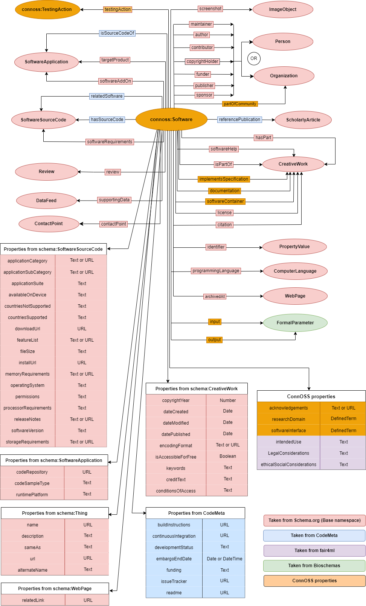

<h1><b>ConnOSS Types</b></h1>

<table>
<tr><th>Type</th><th>Description</th></tr>
<tr><td><a href='./Software'>Software</a></td><td>Extension to schema.org and CodeMeta to describe software source code, software applications, and software releases.</td></tr>

<tr><td><a href='./TestingAction'>TestingAction</a></td><td>The act of testing the software according to its specifications, capturing the object tested, the resulting test report or outcome, and the type of test performed.</td></tr>

</table>

#**ConnOSS Schema Diagram**

