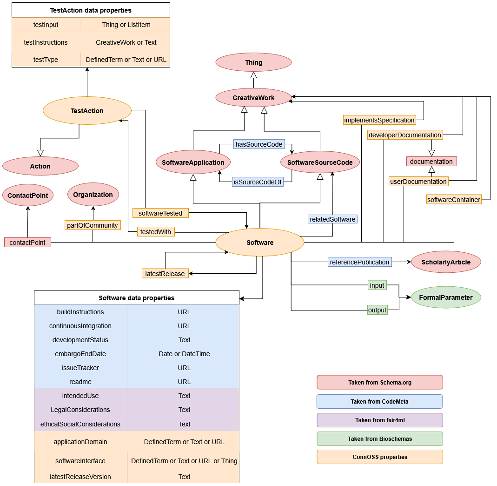

# **ConnOSS Metadata Schema**

##### Version: 0.0.1

##### License: [CC BY-SA 4.0](https://creativecommons.org/licenses/by-sa/4.0/)

##### Download <a href="connoss_Software.jsonld" download> JSON-LD </a>, <a href="connoss_Software.ttl" download> .ttl </a>

##### Status: Draft (under review)

## Description

We have defined a metadata schema for describing research software in a structured and interoperable way within the ConnOSS project. The schema captures metadata elements relevant to research software, including software identity, source code, distribution, contributors, technical requirements, and publication-related information. It reuses existing terms primarily from [Schema.org](https://schema.org/) and [CodeMeta](https://codemeta.github.io/), complemented by 13 additional properties derived from a crosswalk analysis of 21 metadata schemas, vocabularies, and ontologies.

The ConnOSS schema is centered around a unified `Software` type, which integrates properties from the Schema.org types [`SoftwareSourceCode`](https://schema.org/SoftwareSourceCode), [`SoftwareApplication`](https://schema.org/SoftwareApplication), [`CreativeWork`](https://schema.org/CreativeWork), and [`Thing`](https://schema.org/Thing). These types capture different aspects of research software, including its implementation, execution environment, and distribution. While many properties are shared across these representations, each reflects a distinct conceptual perspective on software — its development state, deployment context, or usage requirements. Bringing them together enables a more comprehensive and flexible description of research software than any single type provides on its own.

The schema is organized into a core set of 65 properties drawn from Schema.org and CodeMeta, plus an extension set of 13 ConnOSS-specific properties. It will be further complemented by a metadata profile defining obligation levels (mandatory, recommended, optional), cardinality constraints, and usage guidance — enabling consistent, context-aware metadata descriptions while supporting diverse use cases across domains.

---

## ConnOSS Types

<!-- TERMS:START -->

## connoss:Software

(parent type) [SoftwareApplication](http://schema.org/SoftwareApplication){:target='_blank'} , [SoftwareSourceCode](http://schema.org/SoftwareSourceCode){:target='_blank'} - (type) connoss:Software

Extension to schema.org and CodeMeta to describe software source code, software applications, and software releases.

This type includes properties from schema.org types: [Thing](http://schema.org/Thing){:target='_blank'}, [CreativeWork](http://schema.org/CreativeWork){:target='_blank'}, [SoftwareApplication](http://schema.org/SoftwareApplication){:target='_blank'} and [SoftwareSourceCode](http://schema.org/SoftwareSourceCode){:target='_blank'}, plus the properties below.

Properties

<table>
<tr><th>Property</th><th>Expected Type</th><th>Description</th></tr>
<tr><td><a href='Properties/applicationDomain/'>connoss:applicationDomain</a></td>
<td><a href='http://schema.org/DefinedTerm' target='_blank'>DefinedTerm</a> or <a href='http://schema.org/Text' target='_blank'>Text</a> or <a href='http://schema.org/URL' target='_blank'>URL</a></td>
<td>The discipline, area, or research/application domain to which this software aligns or belongs to.</td>
</tr>
<tr><td><a href='https://codemeta.github.io/terms/#buildInstructions' target='_blank'>codemeta:buildInstructions</a></td>
<td><a href='http://schema.org/URL' target='_blank'>URL</a></td>
<td>Link to the installation instructions/documentation.</td>
</tr>
<tr><td><a href='http://schema.org/contactPoint' target='_blank'>contactPoint</a></td>
<td><a href='http://schema.org/ContactPoint' target='_blank'>ContactPoint</a></td>
<td>A contact point for a person or organization.</td>
</tr>
<tr><td><a href='https://codemeta.github.io/terms/#continuousIntegration' target='_blank'>codemeta:continuousIntegration</a></td>
<td><a href='http://schema.org/URL' target='_blank'>URL</a></td>
<td>Link to the continuous integration service.</td>
</tr>
<tr><td><a href='Properties/developerDocumentation/'>connoss:developerDocumentation</a></td>
<td><a href='http://schema.org/CreativeWork' target='_blank'>CreativeWork</a></td>
<td>Documentation for developers, maintainers, and infrastructure people.</td>
</tr>
<tr><td><a href='https://codemeta.github.io/terms/#developmentStatus' target='_blank'>codemeta:developmentStatus</a></td>
<td><a href='http://schema.org/Text' target='_blank'>Text</a></td>
<td>Description of development status, e.g. Active, inactive, suspended. See repostatus.org.</td>
</tr>
<tr><td><a href='Properties/documentation/'>connoss:documentation</a></td>
<td><a href='http://schema.org/CreativeWork' target='_blank'>CreativeWork</a></td>
<td>Resources that describe the software's installation, usage, configuration, development, and deployment intended to support users and developers in understanding and applying the software.</td>
</tr>
<tr><td><a href='https://codemeta.github.io/terms/#embargoEndDate' target='_blank'>codemeta:embargoEndDate</a></td>
<td><a href='http://schema.org/Date' target='_blank'>Date</a></td>
<td>Software may be embargoed from public access until a specified date (e.g. pending publication, 1 year from publication).</td>
</tr>
<tr><td><a href='https://w3id.org/fair4ml#ethicalSocialConsiderations' target='_blank'>fair4ml:ethicalSocialConsiderations</a></td>
<td><a href='http://schema.org/Text' target='_blank'>Text</a></td>
<td>A documented concern, requirement, or consideration related to the software's design, deployment, or impact across ethical and social dimensions. Enables transparent disclosure of constraints and mitigation strategies.</td>
</tr>
<tr><td><a href='https://codemeta.github.io/terms/#hasSourceCode' target='_blank'>codemeta:hasSourceCode</a></td>
<td><a href='http://schema.org/SoftwareSourceCode' target='_blank'>SoftwareSourceCode</a></td>
<td>Link that states where the software code is for a given software. For example a software registry may indicate that one of its software entries hasSourceCode in a GitHub repository.</td>
</tr>
<tr><td><a href='Properties/implementsSpecification/'>connoss:implementsSpecification</a></td>
<td><a href='http://schema.org/CreativeWork' target='_blank'>CreativeWork</a></td>
<td>A specification that a software implements, including a standard, API or legally defined level of conformance. e.g., the HTTP standard, the OpenAPI spec, OAuth2.</td>
</tr>
<tr><td><a href='Properties/input/'>connoss:input</a></td>
<td><a href='https://bioschemas.org/FormalParameter' target='_blank'>bioschemas:FormalParameter</a></td>
<td>A formal specification of the data, files, or parameters that the software accepts as input, including format, type, and whether the input is required.</td>
</tr>
<tr><td><a href='https://w3id.org/fair4ml#intendedUse' target='_blank'>fair4ml:intendedUse</a></td>
<td><a href='http://schema.org/Text' target='_blank'>Text</a></td>
<td>A concise summary of the primary objective or intended use case for the software. Distinct from general description; this focuses on 'why' the software exists and what problems it solves.</td>
</tr>
<tr><td><a href='https://codemeta.github.io/terms/#isSourceCodeOf' target='_blank'>codemeta:isSourceCodeOf</a></td>
<td><a href='http://schema.org/SoftwareApplication' target='_blank'>SoftwareApplication</a></td>
<td>Link that states where software application is built from a given source code. This is the reverse property of 'hasSourceCode'.</td>
</tr>
<tr><td><a href='https://codemeta.github.io/terms/#issueTracker' target='_blank'>codemeta:issueTracker</a></td>
<td><a href='http://schema.org/URL' target='_blank'>URL</a></td>
<td>Link to software bug reporting or issue tracking system.</td>
</tr>
<tr><td><a href='Properties/latestRelease/'>connoss:latestRelease</a></td>
<td><a href='Types/Software/'>connoss:Software</a> or <a href='http://schema.org/URL' target='_blank'>URL</a></td>
<td>Link to the latest release.</td>
</tr>
<tr><td><a href='Properties/latestReleaseVersion/'>connoss:latestReleaseVersion</a></td>
<td><a href='http://schema.org/Text' target='_blank'>Text</a></td>
<td>Version of the latest release.</td>
</tr>
<tr><td><a href='https://w3id.org/fair4ml#legalConsiderations' target='_blank'>fair4ml:legalConsiderations</a></td>
<td><a href='http://schema.org/Text' target='_blank'>Text</a></td>
<td>A documented concern, requirement, or consideration related to the software's design, deployment, or impact across legal and regulatory dimensions (e.g. licensing constraints, data protection, compliance requirements). Enables transparent disclosure of legal constraints and mitigation strategies.</td>
</tr>
<tr><td><a href='Properties/output/'>connoss:output</a></td>
<td><a href='https://bioschemas.org/FormalParameter' target='_blank'>bioschemas:FormalParameter</a></td>
<td>A formal specification of the data, files, or results that the software produces, including format and type.</td>
</tr>
<tr><td><a href='Properties/partOfCommunity/'>connoss:partOfCommunity</a></td>
<td><a href='http://schema.org/Organization' target='_blank'>Organization</a> or <a href='http://schema.org/Text' target='_blank'>Text</a> or <a href='http://schema.org/URL' target='_blank'>URL</a></td>
<td>A (research) community, consortium, or network that this research artifact (e.g., software) is developed within or affiliated with (e.g., EOSC, NFDI).</td>
</tr>
<tr><td><a href='https://codemeta.github.io/terms/#readme' target='_blank'>codemeta:readme</a></td>
<td><a href='http://schema.org/URL' target='_blank'>URL</a></td>
<td>Link to software Readme file.</td>
</tr>
<tr><td><a href='https://codemeta.github.io/terms/#referencePublication' target='_blank'>codemeta:referencePublication</a></td>
<td><a href='http://schema.org/ScholarlyArticle' target='_blank'>ScholarlyArticle</a></td>
<td>An academic publication related to the software.</td>
</tr>
<tr><td><a href='http://schema.org/relatedLink' target='_blank'>relatedLink</a></td>
<td><a href='http://schema.org/URL' target='_blank'>URL</a></td>
<td>A link related to this object, e.g. related web pages.</td>
</tr>
<tr><td><a href='https://codemeta.github.io/terms/#relatedSoftware' target='_blank'>codemeta:relatedSoftware</a></td>
<td><a href='http://schema.org/SoftwareSourceCode' target='_blank'>SoftwareSourceCode</a> or <a href='http://schema.org/SoftwareApplication' target='_blank'>SoftwareApplication</a></td>
<td>A link to other software that is related by functionality, scientific purpose, or ecosystem context (e.g. alternative implementations, comparable tools, or complementary software).</td>
</tr>
<tr><td><a href='Properties/softwareContainer/'>connoss:softwareContainer</a></td>
<td><a href='http://schema.org/CreativeWork' target='_blank'>CreativeWork</a> or <a href='http://schema.org/URL' target='_blank'>URL</a></td>
<td>A container image or packaged runtime environment of the software.</td>
</tr>
<tr><td><a href='Properties/softwareInterface/'>connoss:softwareInterface</a></td>
<td><a href='http://schema.org/DefinedTerm' target='_blank'>DefinedTerm</a> or <a href='http://schema.org/Text' target='_blank'>Text</a> or <a href='file:///F:/Vocab/vocab/schema/Thing' target='_blank'>Thing</a> or <a href='http://schema.org/URL' target='_blank'>URL</a></td>
<td>The interaction interface (or software product) through which users or other software systems can access, execute, or integrate this software (e.g., CLI, GUI, WebUI, Notebook, API, Library).</td>
</tr>
<tr><td><a href='Properties/testedWith/'>connoss:testedWith</a></td>
<td><a href='Types/TestAction/'>connoss:TestAction</a></td>
<td>Links the software to a testing activity describing how the software is validated, including the test type, required inputs, and test instructions.</td>
</tr>
<tr><td><a href='Properties/userDocumentation/'>connoss:userDocumentation</a></td>
<td><a href='http://schema.org/CreativeWork' target='_blank'>CreativeWork</a></td>
<td>Documentation for end users of the software.</td>
</tr>
</table>

## connoss:TestAction

(parent type) [Action](http://schema.org/Action){:target='_blank'} - (type) connoss:TestAction

The act of testing the software according to its specifications, capturing the object tested, the resulting test report or outcome, and the type of test performed.

Properties

<table>
<tr><th>Property</th><th>Expected Type</th><th>Description</th></tr>
<tr><td><a href='Properties/testType/'>connoss:testType</a></td>
<td><a href='http://schema.org/Text' target='_blank'>Text</a> or <a href='http://schema.org/URL' target='_blank'>URL</a> or <a href='http://schema.org/DefinedTerm' target='_blank'>DefinedTerm</a></td>
<td>The type of test that it is performed on the object.</td>
</tr>
<tr><td><a href='Properties/testInput/'>connoss:testInput</a></td>
<td><a href='http://schema.org/Thing' target='_blank'>Thing</a> or <a href='http://schema.org/ListItem' target='_blank'>ListItem</a></td>
<td>Input used to performed the test. Some tests may not require any input, some may require multiple ones. If order or grouping is important in the case of multiple inputs, a ListItem could help.</td>
</tr>
<tr><td><a href='Properties/testInstructions/'>connoss:testInstructions</a></td>
<td><a href='http://schema.org/text' target='_blank'>text</a> or <a href='http://schema.org/CreativeWork' target='_blank'>CreativeWork</a></td>
<td>Specific test instructions for testing the software.</td>
</tr>
</table>

<!-- TERMS:END -->

&nbsp;

## ConnOSS Schema Diagram

&nbsp;

